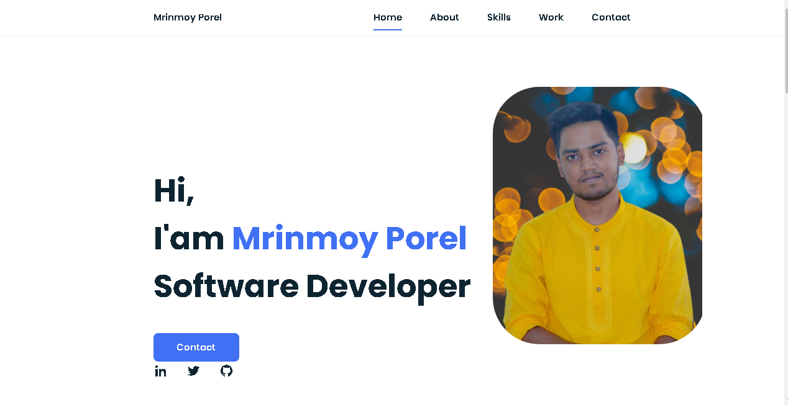

# portfolio1
<h2>A static Portfolio Website built using HTML5 and CSS3.</h2>
 
<a href="https://mrinnnmoy.github.io/portfolio1/" target="_blank">Visit here🚀</a>

 
# 🖼️ Preview 

#  Made with ❤️ by <a href="https://www.linkedin.com/in/mrinnnmoy/" target="_blank">Mrinmoy Porel</a>
 
